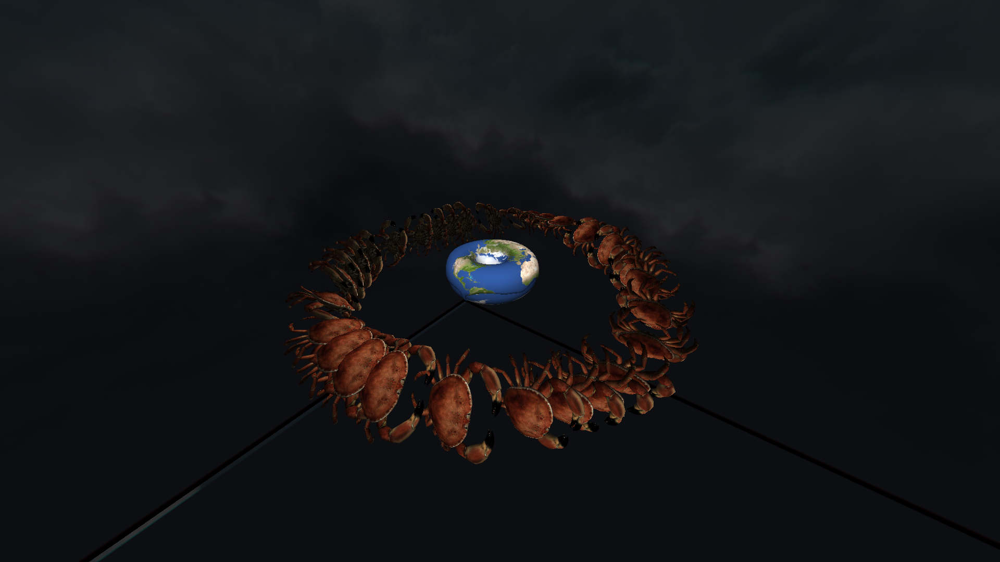

ngl the structure of this project is based off vibes
# game-engine
game engine written in zig, this was made from scratch using a glfw window and opengl, all math and other file loading was programed myself. before you ask yes i am insane. so what makes this game engine differnt from the other, well let me tell you this game engine is shit, but pretty fast. Although in all honesty, i do use zig features for some cool features within this game engine such as complie time known uniforms and programs, since these should be known at complie time.

warning i dont think i free everthing correctly yet so your gpu memory may start filling.

# project structure

currently the project has 4 main directories:
- `src` : this is where the code is stored
    - `app` : where the abstraction of the app is stored as well as a basic program
    - `console_logger` : an simple console logger that allows for coloured texture and changing the cursor pos (only works with true colour terminals)
    - `file_loading` : all the file loading code such as bmp and wavefront object files
    - `math` : where the math is like matrixes and vectors
    - `objects` : 3d game objects and a loading service for them
    - `opengl_wrappers` : wrappers for opengl functions
- `textures` : this is where all the game textures are stored
- `objects` : where the 3d objects are stored
- `shaders` : where the glsl shaders are stored

# features
## currently this game engine supports:
- loading [bmp](https://www.ece.ualberta.ca/~elliott/ee552/studentAppNotes/2003_w/misc/bmp_file_format/bmp_file_format.htm) image files
- loading [tga](https://docs.fileformat.com/image/tga/) image files
- loading [wavefront object](https://en.wikipedia.org/wiki/Wavefront_.obj_file) files but only triangluar ones (the only good ones, quads are even real they are just 2 triangles)
- loading custom [dat object](https://books.google.com.br/books/about/Computer_graphics_for_Java_programmers.html?id=vY5RAAAAMAAJ&redir_esc=y) files
- an object loading service to cache objects that have already been sent to the gpu
- Blinn–Phong lighting
- texture rendering
- screenshots

## the engine also supports more advance fetures such as:
- allowing multiple opengl programs
- fully custom opengl programs at complie time

# how to run
currently the game engine uses zig version `0.13.0-dev.351+64ef45eb0` as this is the lastest version that can complie `zig glfw`.
to build just run `zig build`

# controls
currently there are hard coded controls theses are
|key| action|
|-|-|
|`w`| foward|
|`s`| backwards|
|`a`| left|
|`d`| right|
|` `| up|
|`left_ctrl`| down|
|`-`| speed increase|
|`=`| speed decrease|
|`r`| reload shaders|
|`esc`| stop |
|`p`| screen shot|
